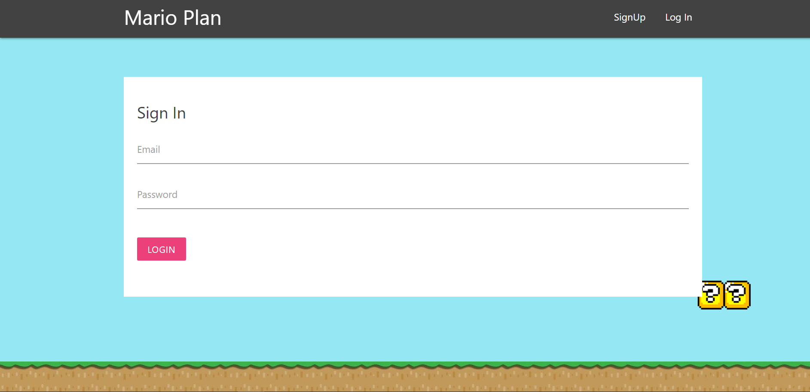
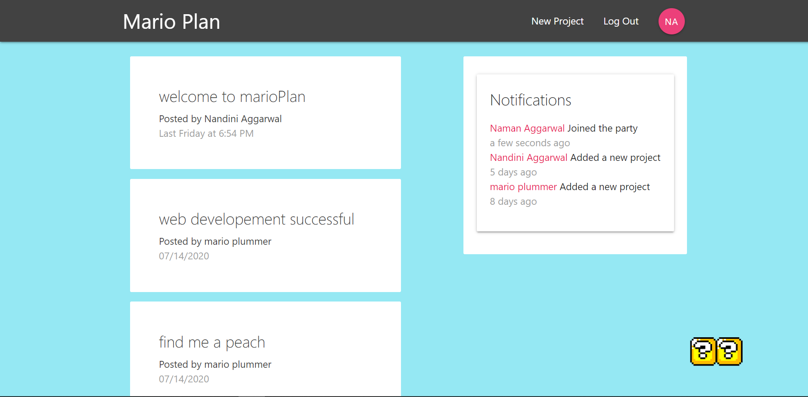

A project Planner made using **React**, **React Hooks** and **Redux** with a database deployed on **firebase**. 
It notifies you when someone joins the group and when someone add a project.

# Preview

SignIn Page

Dashboard

## Available Scripts

In the project directory, you can run:

### `npm start`

Runs the app in the development mode. 
Open [http://localhost:3000](http://localhost:3000) to view it in the browser.

The page will reload if you make edits. 
You will also see any lint errors in the console.

## The project is Live On:

https://project-planner-awesome.web.app
